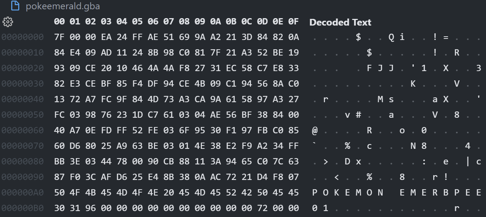

# 概念篇

## 二进制改版 Binary Hack
这里的二进制文件，是你在掌机磁盘上的游戏数据，也是所谓的ROM(Read Only Memory)文件。

市场上现有的二进制文件是Gf编写代码编译出来的成品，在现代电脑上普遍格式是.gba。掌机/模拟器通过解析这个二进制文件来和你呈现各种被设计好的互动。

### 改版方法
1. 最初是有些大佬通过粗略的反编译及猜测推理，得出一些数据组在二进制文件的位置，使用二进制编辑器对文件进行改动，来实现Mod，普遍用于修改图片，数值，脚本及地图，甚至通过重新指向的方式扩充数据上限。
2. 后来有大佬开始编写ASM语言(Assembly Language)代码，通过callasm或者hook的方式来实现稍微复杂的改动或者新功能，这方面较多涉及战斗系统和功能扩展。
3. 接着有人尝试编写C语言代码，并编译成二进制代码后，通过callasm或者hook的方式来实现复杂的改动或者新功能。

### 优势
1. 门槛很低，不需要太深入的编程知识就可以入门。
2. 很多工具，研究记录和教程让你参考，甚至有一堆补丁和一键工具泛滥的现象。

### 劣势
1. 传统的做法难以记录及备份，常常因为一些无法定位源头的bug回滚到原点。
2. 空间规划差，在原先的数据地址遗留空位，或者空间不足需要重新指向。
3. 数据结构限制，常常需要重写整个函数来解读扩展内容，也就是所谓的解限。
4. 缺乏规划的hook导致不必要的资源浪费及冲突。
5. 难以多人协作，就像大学组别作业需要一个人来合并，最后容易出现一堆冲突。
6. 过度的复制贴贴导致改版者忽视某些功能的背后原理，最后不理解bug怎么出现。

### 常见的问题
1. 存储数据溢出，最后checksum出现坏蛋，例如使用错误的变数编号。
2. 内存溢出，出现不想要的结果，例如殿堂精灵编号512过后异常。
3. 乱码或图形崩坏，导入的内容无法正常读取，例如色板错误的精灵。

<Tip>
这些问题的主要原因还是缺乏改动的认知及忽视补丁的冲突。
</Tip>

## 反编译改版 Decompilation Hack

上文说的Gf编写的代码，只要有这份代码就可以自行编译想要的内容，当然在现实这是不可能的。有些大佬通过更深入的整理把这个二进制文件的源码一步一步用c语言重新写出来，也就是反编译。这个过程花了很多年才到达今天的地步，也就是因为这个反编译代码才让我们更接近理想,也让我们更加了解游戏所有的结构设计。

### 优势
1. 代码或资源更容易做版本管理。
2. 方便多人协同。
3. 编译成品不会有空位遗留问题。
4. 原本数据及函数的可扩展性。
5. 自动化

### 劣势(劝退)
1. 编程门槛，需要基本的c语言理解。
2. 特定的改动也需要知道一定程度的gba概念。
3. 理解整个项目有一定程度的心智负担。
