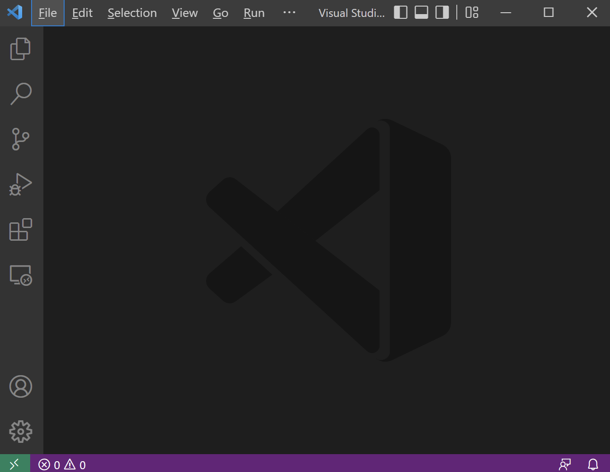

## 安装篇
我个人是用window10+wsl2+VSCode+mGBA的组合，蓝本用的是绿宝石，在这个博客里大部分也将会是这套作业做教程及截图。你可以参考
<a href="https://github.com/pret/pokeemerald/blob/master/INSTALL.md">pokeemerald官方安装文档</a>了解其他安装方式。

### WSL
1. 可以在微软的商店里边搜索Ubuntu，选一个版本来安装。


2. 安装好后可以点右上角的开启打开wsl。

以后也可以在Start打开


3. 首次开启需要设置用户及密码

依次输入用户名，密码，确认密码就可以了


4. 在终端输入以下指令来检测及安装更新
```bash
sudo apt update
sudo apt upgrade
```

<Tip>WSL 2比起WSL 1 有着更好的IO性能，但在这里可能对一些工具的兼容不是很友好，如porymap<4.5.0。</Tip>

### VSCode(可跳过)
1. 下载后全部默认安装就行了，然后直接打开VSCode。


2. 键盘<kbd>Ctrl</kbd>+<kbd>`</kbd>快捷打开终端

3. 然后右上角选择默认终端为WSL


4. 以后就可以在VSCode默认使用WSL终端


### 相关依赖和git
1. 在wsl终端输入以下指令安装编译依赖
```bash
sudo apt install build-essential binutils-arm-none-eabi git libpng-dev
```
2. 全回答yes安装就行

### 克隆反编译文件
1. 克隆pokeemerald仓库
```bash
git clone https://github.com/pret/pokeemerald my-poke-hack
```

<Tip>这里我的仓库名字是my-poke-hack，你可以自由选择</Tip>

### 克隆及编译agbcc
1. 克隆agbcc仓库
```bash
git clone https://github.com/pret/agbcc
```

2. 进入agbcc文件夹并编译,这里会花几分钟
```bash
cd agbcc
./build.sh
```

### 安装agbcc进反编译文件夹
在agbcc文件夹里使用
```bash
./install.sh ../my-poke-hack
```


<Tip>
这个agbcc只需要编译一次，以后直接安装去需要的仓库就行了。
</Tip>

### 编译ROM
1. 进入反编译文件夹
```bash
cd ../my-poke-hack
```
2. 编译测试，这个过程会花几分钟。
```bash
make compare
```

看见ok就代表编译成功
<Tip>
这里的compare参数会指示Makefile对比编译成品和原作，无任何改动的情况下正常都会出现OK。
</Tip>