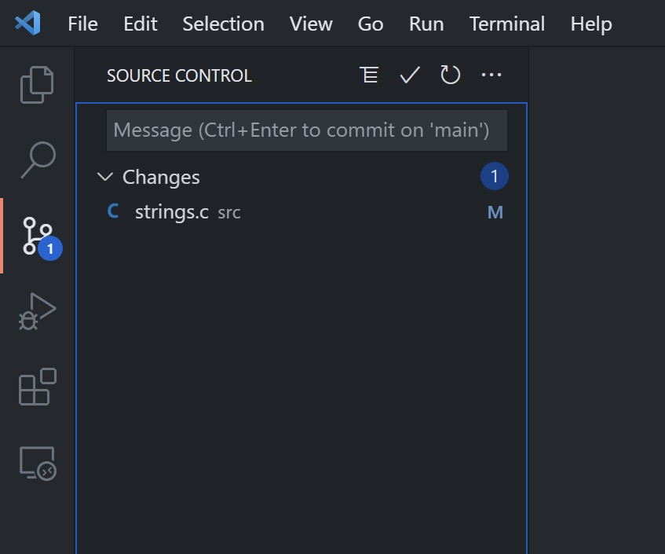
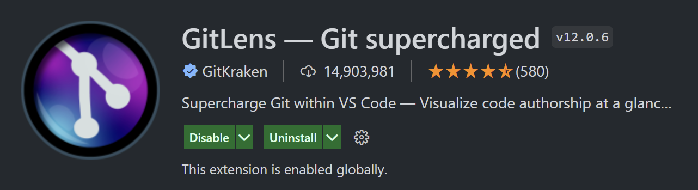
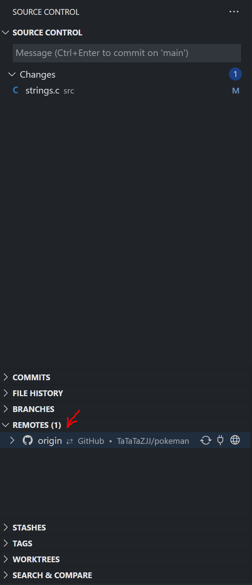

## 代码管理
在这里，代码管理主要可以让你更有效的：
- 复制贴贴一个完整的项目
- 多人远程协同一个项目
- 新增回滚一些改动
- 复制贴贴别人的改动

当然代码管理的好处还有更多；比起过去的复制贴贴整个ROM，代码管理的备份机制容易且有效。

## 代码管理基础
[git官方文档传送门](https://git-scm.com/book/zh/v2)

### 本地仓库（local）
在你的个人电脑上面的文件夹。

### 远程仓库（remote）
在代码托管平台主机的文件夹，可以公开或者私有化。

### 提交（commit）
你所记录的改动，一个提交是一个信息和一组改动的组合，建议使用简洁明了的提交信息来辨别改动记录。

### 克隆（clone）
复制远程仓库到本地。

### 上传（push）
上传本地仓库的提交记录到远程仓库。

### 下载（pull）
下载远程仓库的提交记录到本地仓库。

### 合并（merge）
把两个相同源头的仓库的提交记录合并起来，保存去其中一方。

<SeparateLine/>

## git

git是个代码管理工具，而Github是个线上代码托管平台（其他例子：Gitlab，
Bitbucket）。当然我建议你在Github上创建一个账号，这使你后续管理和多人协同非常方便。你可以通过[github快速入门文档](https://docs.github.com/cn/get-started/quickstart)来入门Github。

<Tip>你可以选择在window或wsl上面安装git，要注意的是在vscode上使用wsl的git需要远程启动，我个人是两边都安装，比较方便。</Tip>

## 在window上安装git
[传送门](https://gitforwindows.org/)

## 在wsl上安装git
```bash
sudo apt install git
```

## 在vscode上使用git
你可以在左边的栏目或者用 <kbd>Ctrl</kbd>+<kbd>Shift</kbd>+<kbd>g</kbd> 打开版本控制界面如下：

在这里你可以看见你所作的改动。

我也建议你安装这个插件来可视化更多git的功能


<SeparateLine/>

## 一些实用的git技巧


### 克隆仓库
你可以下载你私有或者开源的远程仓库到你的电脑，这个过程叫克隆。

```bash
git clone https://github.com/pret/pokeemerald.git
```

注意的是你上传的提交记录将会被推送去这个克隆的源头（origin），如果不想要这样，可以在本地仓库上移除远程仓库的地址。

你可以通过gitlens插件查看本地仓库的远程仓库地址



### 在本地仓库移除远程仓库地址
```bash
git remote remove origin
```

### 在本地仓库新增远程仓库

在github等线上代码托管平台创建仓库后，你可以在你的本地仓库添加该地址
```bash
git remote add origin <你的远程仓库地址>
```

在你的本地仓库里的终端运行以下指令来添加口袋人的远程仓库
```bash
git remote add pokeman https://github.com/TaTaTaZJJ/pokeman.git
```

### 合并特定的功能

1. 在远程仓库地址找到想要的提交记录、分支，右键选择`Cherry Pick Commit`


2. 一般情况下你可以选择第一种，就是直接提交该记录，第二种是让你在提交前做自己想要的编辑，第三种则是不提交。


3. 之后可以在这里找到这个提交记录

