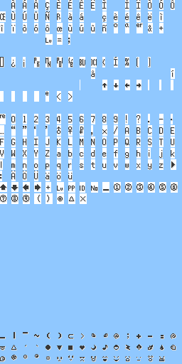
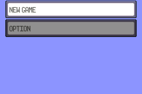
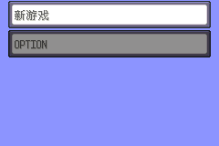

## 汉化

在反编译改版里，标准的汉化流程是这几个步骤
1. 添加汉字的字模及码表
2. 修改字体渲染函数，让其能读取中文字体
3. 替换文本成中文。
4. PS修改图像文字。
5. 编译

<Tip>我个人喜欢用脚本提取文本，然后用JSON文件整理好多种语言，最后编译器用脚本切换文本。</Tip>

### 原理
你可以在`graphics\fonts`里找到字模，例如：



然后在根目录的`charmap.txt`得到拉丁和日文码表，具体如下：
```txt
' '         = 00                    空格字符
'À'         = 01                    拉丁字符
POKEBLOCK   = 55 56 57 58 59        特殊控制字符
'$'         = FF                    结束字符

EMOJI_BIGANGER = F9 FE              表情字符

'\l' = FA @ scroll up window text   下滑控制字符
'\p' = FB @ new paragraph           下一段控制字符
'\n' = FE @ new line                下一行控制支付

```

你也可以在`src\fonts.c`找到字体常数和宽度：
```c
ALIGNED(4) const u16 gFontSmallNarrowLatinGlyphs[] = INCBIN_U16("graphics/fonts/small_narrow.latfont"); // 预处理过的字模二进制文件
ALIGNED(4) const u8 gFontSmallNarrowLatinGlyphWidths[] = {
    3,  5,  5,  5,  5,  5,  5,  5,  5,  4,  3,  4,  4,  5,  5,  5,
    5,  5,  5,  5,  5,  5,  5,  5,  3,  4,  5,  5,  5,  5,  4,  3,
    4,  4,  5,  5,  5,  5,  5,  5,  5,  5,  5,  5,  8,  5,  6,  3,
    3,  3,  3,  3,  8,  0,  3,  3,  3,  3,  3,  3,  3,  3,  3,  3,
    3,  3,  3,  3,  3,  3,  3,  3,  3,  3,  3,  3,  3,  3,  3,  3,
    5,  5,  3,  8,  8,  8,  8,  8,  8,  8,  4,  5,  4,  4,  3,  3,
    3,  3,  3,  3,  3,  3,  3,  3,  5,  3,  3,  3,  3,  3,  3,  4,
    3,  3,  3,  3,  3,  3,  3,  5,  3,  8,  8,  8,  8,  1,  2,  3,
    4,  5,  6,  7,  5,  5,  5,  3,  3,  3,  3,  3,  3,  3,  3,  3,
    3,  3,  3,  3,  3,  3,  3,  3,  3,  3,  3,  3,  3,  3,  3,  3,
    7,  5,  5,  5,  5,  5,  5,  5,  5,  5,  5,  4,  5,  3,  5,  5,
    5,  5,  5,  3,  3,  5,  5,  5,  3,  5,  5,  5,  5,  5,  5,  5,
    5,  5,  5,  4,  5,  5,  5,  5,  5,  5,  5,  5,  5,  5,  4,  5,
    5,  5,  5,  4,  5,  5,  5,  5,  5,  5,  5,  5,  5,  4,  4,  5,
    4,  5,  5,  5,  5,  5,  5,  5,  5,  5,  5,  5,  5,  5,  5,  7,
    3,  5,  5,  5,  5,  5,  5,  3,  3,  3,  3,  3,  3,  3,  3,  3,
    8,  8,  8,  8,  8,  8,  8,  8,  8,  8,  8,  8,  8,  8,  8,  8,
    8,  8,  8,  8,  8,  8,  8,  8,  3,  3,  3,  3,  3,  3,  3,  3,
    3,  3,  3,  3,  3,  3,  3,  3,  3,  3,  3,  3,  3,  3,  3,  3,
    3,  3,  3,  3,  3,  3,  3,  3,  3,  3,  3,  3,  3,  3,  3,  3,
    3,  3,  3,  3,  3,  3,  3,  3,  3,  3,  3,  3,  3,  3,  3,  3,
    3,  3,  3,  3,  3,  3,  3,  3,  3,  3,  3,  3,  3,  3,  3,  3,
    3,  3,  3,  3,  3,  3,  3,  3,  3,  3,  3,  3,  3,  3,  3,  3,
    3,  3,  3,  3,  3,  3,  3,  3,  3,  3,  3,  3,  3,  3,  3,  3,
    3,  3,  3,  3,  3,  3,  3,  3,  3,  3,  3,  3,  3,  3,  3,  3,
    3,  3,  3,  3,  3,  3,  3,  3,  3,  3,  3,  3,  3,  3,  3,  3,
    3,  3,  3,  3,  3,  3,  3,  3,  3,  3,  3,  3,  3,  3,  3,  3,
    3,  3,  3,  3,  3,  3,  3,  3,  3,  3,  3,  3,  3,  3,  3,  3,
    3,  3,  3,  3,  3,  3,  3,  3,  3,  3,  3,  3,  3,  3,  3,  3,
    8,  8,  8,  8,  8,  8,  8,  8,  8,  8,  8,  8,  8,  8,  8,  8,
    8,  8,  8,  8,  8,  8,  8,  8,  8,  8,  8,  8,  8,  8,  8,  8,
    8,  8,  8,  8,  8,  8,  8,  8,  8,  8,  8,  8,  8,  8,  8,  3,
}; // 字模对应的宽度
```

在`gflib\text.c`有着文本渲染函数，比较复杂就不放在这里了。


最后在`src\strings.c`里找到文本：
```c
const u8 gText_MainMenuNewGame[] = _("NEW GAME"); //第24行
```

编译后对应这里的文字：


<Tip>在反编译代码里，你可以看见很多类似`_("TEXT")`的语法。这个语法里边的文字在编译之前，会被预先处理成对应的编码，写脚本的时候也可以看这个语法来处理。</Tip>

### 改动
https://github.com/TaTaTaZJJ/pokeman/commit/4cfb656fb3600788a4f4f9d61a1c9b7876ce5c8a

改动内容比较多，简单来说是：
1. 添加汉字的字模及码表，添加预处理规则
2. 修改字体渲染函数，让其能读取中文字体
3. 替换文本成中文。
   
### 成品

